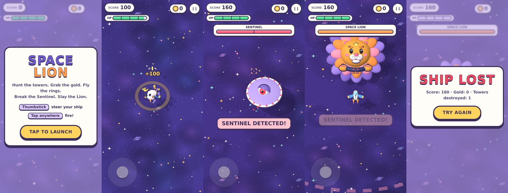

# Space Lion

A top-down mobile space shooter in the spirit of *Xevious* / *Sinistar*: your ship
flies continuously, steered with a virtual thumbstick, while you tap anywhere to
fire at a reticle fixed ahead of your nose. Rendered in 3D with three.js, using a
procedural asset set (no external art/model files).

The art style follows [gig-ambulance](https://github.com/mtd-public/gig-ambulance):
chunky, smooth-shaded toy shapes with thin ink outlines and soft drop shadows,
pastel colours on a purple-twilight "space mat", and a HUD of cream pills and
cards with thick ink borders. The camera is a pitched orthographic "diorama"
view; the stick is corrected for the pitch so the ship flies where you point.



## Features

- Always-forward ship movement steered by a virtual thumbstick (bottom-left)
- Tap/hold anywhere else to fire at a reticle projected ahead of the ship
- Pitched orthographic camera that follows the player through a bounded open
  world: a painted nebula floor far below with floating toy planets, crystals
  and moon rocks, and a ring of buoys marking the edge
- Tower enemies (grumpy one-eyed turrets on floating islands) that track and
  shoot the player; the pupil glows and the head shakes before firing
- Gold pickups scattered through the world
- Ring courses: fly through a sequence of rings in order for a score bonus;
  each course replays after a cooldown once cleared
- **The Sentinel** — a recurring mini-boss UFO with *persistent* health: each
  encounter you can chip away one third of its total health before it warps
  out and flees; it returns later at whatever health remained, across as many
  encounters as it takes to fully destroy it
- **The Space Lion** — the final boss, unlocked once the Sentinel is fully
  destroyed. Defeating it wins the game
- Score, gold count, player health bar, segmented boss health bar, pop-in
  toast banners, floating combat text, game over / victory / retry flow
- Toy-style effects: outlined star bursts, puffs and debris, shock rings and
  a little camera shake

## Running locally

No build step — three.js and the asset library are vendored as plain
`<script>` tags in `js/vendor/`, and the game
code itself is plain ES modules. Serve the folder with any static file
server and open it on a phone (or narrow a desktop browser window):

```
npx http-server -p 8080
# or: python3 -m http.server 8080
```

Then visit `http://localhost:8080`.

## Controls

- **Thumbstick** (bottom-left of the screen): drag to steer. The ship keeps
  flying in the last direction you set even after you let go.
- **Tap or hold anywhere else**: fire.
- Desktop testing: WASD/arrow keys to steer, Space to fire.

## Project layout

- `js/vendor/` — vendored three.js (r136, classic global build) and
  `space-assets.js` (the procedural toy-style ship/tower/boss/backdrop factory,
  including the ink-outline and rounded-geometry helpers)
- `js/world.js` — world layout generation and the floor/decor/buoy backdrop
- `js/fx.js` — particle bursts and shock rings
- `js/entities.js` — player ship, bullets, towers
- `js/collectibles.js` — gold pickups and ring courses
- `js/boss.js` — the Sentinel and Space Lion boss encounters
- `js/hud.js` — the 2D canvas HUD overlay (score, health, boss bars, messages)
- `js/main.js` — scene/camera/renderer setup and the game loop/state machine

## History

An earlier 2D-canvas prototype (movement/shooting/tower enemies only, no 3D
rendering) is preserved on the `archive/prototype-2d` branch.
